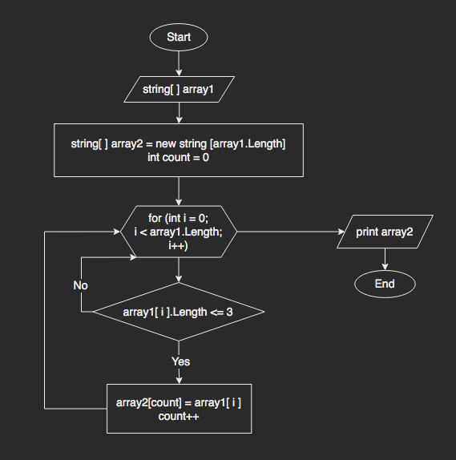

# Итоговая проверочная работа

## Задача: 
Написать программу, которая из имеющегося массива строк формирует новый массив из строк, длина которых меньше, либо равна 3 символам. Первоначальный массив можно ввести с клавиатуры, либо задать на старте выполнения алгоритма.

## Решение: 
- Вводим с клавиатуры первый массив из строк, отделяя элементы пробелами. Объявляем второй массив. 
- Запускаем функцию, которая проверит каждый элемент-строку первого массива и перенесет строки с длиной <= 3 символа во второй массив. 

 > *Для этого сделаем цикл, внутри которого с помощью if проверим условие (длина строки <=3) - если условие выполняется, то в [ count ] элемент второго массива заносим [ i ] элемент первого массива.*

- Распечатаем второй массив

## Блок-схема решения:

## Ход решения: 
1. Создать репозиторий на GitHub;
2. Нарисовать блок-схему;
3. Снабдить репозиторий текстовым описанием (файл README);
4. Написать программу, решающую задачу (файл Program).